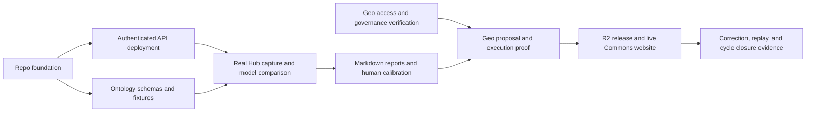

# Cycle build plan: development-ready repo and live agent API

**Updated next milestone:** automatic report delivery and Geo proposal integration now proceed in tandem, using OpenAI/Luna initially. Follow [automatic reports alongside Geo](automatic-reports-and-geo.md). The original bounded prompts and cycle sequence below remain historical context; full model comparison is deferred.

9 September 2026 · Proposed delivery plan; current Linear cycle membership unverified

**Build the repo foundation and a live, authenticated ingestion API first, then prove Geo submission and website publication.** The first operational milestone is a real Hub thread producing a reviewable ingestion report through the deployed API. A responding health endpoint is infrastructure progress, not completion of the ingestion issue.

This plan maps the issues researched on September 8 to concrete build and closure evidence. The current Linear connector points to Greenpill Dev Guild, not Regen Coordination; the available browser session requires sign-in. Current cycle dates, issue membership, statuses, assignees, and changed acceptance criteria could not be refreshed. Confirm the cycle issue IDs and end date before treating the issue map below as a cycle commitment. No Linear issues or team messages were changed.

## Final review with Afo

The architecture is sufficiently defined to start the foundation. Review these three artifacts to settle the content decisions:

| Artifact | Decision to record | What can proceed before the decision |
|---|---|---|
| [Ontology candidate](../ontology/v1-candidate.md) | Approve or amend shared metadata, Claim with typed evidence, eleven variants, predicate directions, and initial enabled classes. Pin the executable registry digest after fixture review. | Workspace, API deployment, candidate schemas and tests. Candidate mode must remain visibly unratified. |
| [Pilot shortlist](../research/2026-09-09-pilot-selection.md) | Start with topics 235, 403, 356; add 393; hold out 379 after complete capture. Record any source exclusions. | Deterministic source adapter and capture-completeness checks. |
| [Report and Integrity profile](../../reports/ingestion/README.md) | Accept or amend the five-dimension draft rubric and what evidence supports each rating. Confirm calibration precedes score thresholds. | Report rendering and model-comparison instrumentation; missing assessments stay explicit. |

Already settled: `ontology`, `pipeline`, `agent`, `web`; Afo owns the ontology pin; two distinct affirmative human approvals; repo-based ingestion reports; the owned Knowledge Commons website is the v1 surface. These do not need another architecture debate.

## Questions for the team

Use a short working session to leave with named owners and recorded decisions. The questions below are prepared for discussion; they have not been sent to the team.

| Question | Suggested starting position | Person or role needed |
|---|---|---|
| Which issues are committed in this cycle, what is the end date, and who is implementing/reviewing each? | Make the live ingestion API and completed pilot reports the first demo. Retain Geo and website work in the commitment if they are already cycle issues; expose their dependencies explicitly. | Cycle lead and implementer; confirm names |
| Do the concrete ontology examples express the meaning we want? | First enable Article, Source, Claim; settle all class definitions, then enable CaseStudy with reviewed examples. Use ontology release `0.1.0` for product v1. | Afo decides; team reviews examples |
| Who are the two content reviewers, and how many objects can they review per session? | Begin with one or two objects per batch. Each reviewer independently approves the exact revision and scope; edits invalidate prior approval. Start with two scheduled review sessions during the cycle. | Two distinct humans, plus a review coordinator |
| Which Cloudflare account and repository deployment path should own this service? | One Hono Worker, Workflows, a D1 ledger, private source/report artifacts, and public R2 release storage. Start with a protected service URL; do not let custom-domain work block the pilot. | Deployment/billing owner and a backup |
| Who supplies the model projects and owns the evaluation budget? | Compare all four selected models with a proposed $10 initial evaluation cap. Use team-owned credentials installed as deployment secrets; record actual usage. | Model/billing owner; no secrets in meeting notes or chat |
| What exact Geo service and credential path should we use, and who can verify it? | Confirm whether the API key authorizes upload, proposal submission, or delegated signing; identify network, DAO/author spaces, proposing identity, governance configuration, sponsorship and indexing. | Geo integration contact and implementation owner |
| How should the older issue scope reflect the owned-website v1 and calibration-first approach? | Keep partner integrations as follow-up work. Review whether 3D rendering is needed for the first website; deferral is a recommendation, not a confirmed separate decision. Keep raw source reuse restrictions explicit. | Cycle lead, website owner, and content stewards |

Suggested session: 10 minutes on cycle scope and owners, 15 on ontology and source fixtures, 10 on a report/review rehearsal, and 10 on deployment/Geo dependencies. Conclude with a decision record and the next review date. Credential values are configured through the approved secret-management path, not copied into that record.

## Build sequence

Each step should produce a reviewable change and observable completion evidence. Dates remain unassigned until cycle capacity is known. Foundation work and Geo discovery can proceed concurrently without multiplying deployed services.

### 1. Bootstrap the repo

Create the four package workspaces with explicit public exports and the dependency direction `agent -> pipeline -> ontology`; `web` consumes public contracts. Pin Bun and the selected dependency versions in the lockfile. Use TypeScript, one formatter/linter, and behavior-focused tests appropriate to the Workers runtime and pure domain logic.

Add root commands for setup, development, formatting/linting, type checking, tests, builds, ontology generation, and report export as each becomes real. Document the verified commands in README and AGENTS.md. Add CI for the same checks and generated-file drift. Keep local `.dev.vars`, Wrangler state, caches, and raw captures out of git; provide variable-name-only examples. The current ignore file covers `.env` files but needs Workers-specific entries during bootstrap.

Keep root `agent/skills` canonical. Demonstrate that a contributor can invoke/read the relevant skill from their chosen assistant, using a documented adapter where native discovery needs one. Choose the repo's own license explicitly; the vendored Matt Pocock license only covers those upstream files.

**Done evidence:** a second contributor starts from a clean checkout, follows the documented setup, runs the checks, and makes a small fixture change without needing undocumented local files. CI passes on that change. The workspace exists as working code, not empty directories.

### 2. Deploy the protected agent API

Implement Hono in `packages/agent`. Keep HTTP parsing and authentication separate from domain operations. Configure development and deployed bindings, database migrations, private artifact storage, structured run logs, and a documented rollback/redeploy path. Cloudflare documents [Hono on Workers](https://developers.cloudflare.com/workers/framework-guides/web-apps/more-web-frameworks/hono/); runtime compatibility still needs this repo's smoke test.

The proposed initial HTTP contract is:

| Route | Observable behavior |
|---|---|
| `GET /health` | Minimal service/build status; no secrets or internal configuration. |
| `GET /ready` | Authenticated binding/configuration readiness, with unavailable capabilities stated. No billable model calls on every health check. |
| `GET /v1/ontology` | Version/digest, enabled classes, and candidate versus pinned status. |
| `POST /v1/validate` | Schema and semantic diagnostics for a bounded candidate; does not approve or publish it. |
| `POST /v1/ingestions` | Authenticated, authorized submission of explicit allowlisted topic IDs and comparison configuration; return `202` plus run ID. |
| `GET /v1/ingestions/:runId` | Authorized run status, attempts, actionable failures, and artifact references. |
| `GET /v1/ingestions/:runId/report` | Authorized retrieval of the review-safe Markdown report when ready. |

Authenticate callers and authorize run access; knowing a run ID is insufficient. Separate permission to inspect from permission to incur model costs or submit a Geo proposal. Keep source URLs bounded by the manifest rather than accepting arbitrary crawl targets. Publish an OpenAPI contract and a copyable authenticated example with placeholders.

Use one idempotency key per caller/request intent. Reuse with the same payload returns the existing run; reuse with a different payload rejects the request. Geo submission is a later controlled capability, disabled until its integration is verified. The model does not decide which credentials or operations it can access.

**Done evidence:** deployed URL and build revision; unauthorized requests rejected; an authorized fixture job can be inspected; oversized or invalid requests fail usefully; persistent state survives a restart. This milestone establishes deployment, but does not yet close KC-24.

### 3. Implement the ontology and review contracts

Translate the reviewed candidate into the canonical registry, Zod variants, semantic validation, and fixtures. Generate JSON Schema and compact human/agent references from the actual source. Include SourceCapture, candidate, evidence reference, run/usage, assessment, and report contracts alongside the public Knowledge Object shapes; keep operational records separate from semantic objects.

Test planned versus reported knowledge, evidence selector resolution, source revisions, disabled classes, inverse relations, and stable identity. Record Afo's exact version/digest decision when the fixture review is complete. Candidate evaluation can run earlier, but cannot silently become an active ontology release.

**Done evidence:** valid and invalid fixtures produce expected diagnostics; generated outputs match the registry; Afo's pin is recorded; old capture references remain traceable. The first enabled classes work end to end. If an issue requires all eleven executable schemas, reserved prose definitions alone do not satisfy it.

### 4. Implement capture, comparison, and report export

Build deterministic Hub capture with pagination/completeness checks, native post IDs, dates, content digests, and bounded outward retrieval. Freeze evidence before inference. Run the four declared models through a small shared result contract with provider-specific settings, bounded retries and spending, validated outputs, and actual usage records.

Use Workflows for durable steps and D1 for the run ledger. A retried workflow must not repeat an external mutation merely because its response was lost. Model calls and artifact writes need explicit attempt identities and recorded outcomes; resumability alone does not guarantee idempotency. See [Cloudflare's workflow rules](https://developers.cloudflare.com/workflows/build/rules-of-workflows/).

Render the human report from the run record. **Bridge cloud artifacts into the repo with an authenticated local export command** that writes review-safe Markdown to `reports/ingestion/<topic-id>-<slug>/<date>-<run-id>.md`. The Worker stores artifacts and serves the report; it does not need a GitHub write token. Export checks the run ID/digests, excludes raw or sensitive content, and preserves older reports. A git review of a report is not automatically a knowledge approval.

**Done evidence:** a real thread goes through the deployed API to a complete captured evidence packet, four separately recorded outputs, meaningful validation results, and a report exported into this repo. A partial capture, provider failure, and budget stop are visible and recoverable. No missing model score is filled with an estimate.

### 5. Calibrate with the two reviewers

Run the agreed development, validation, and held-out topics. Review outputs without model labels where practical. Record the five-dimensional Integrity profile, evidence errors, useful abstentions, and correction minutes per output; score any final edited candidate separately. Resolve label disagreements, revise prompts or schemas as needed, and create a new comparison batch when inputs change.

Do not create an automatic rejection threshold from five clean examples. Choose the default model based on observed errors, cost, and review effort, stating sample size and remaining uncertainty. Rehearsal approvals remain separate from Geo votes.

**Done evidence:** per-topic reports with actual comparison data and human review records; a documented default-model decision; ontology/rubric changes tied to observed errors; no unsupported claim promoted merely because the aggregate score is high.

### 6. Complete Geo proposal and governance verification

Begin access discovery alongside steps 1–3. Verify the exact credential path, proposing identity, SDK/runtime combination, chain and spaces, stable mappings, transaction funding, and proposal-version readback. Confirm the deployed rules support the two-affirmative-human requirement; test the negative cases, including one YES plus one ABSTAIN, duplicate identities, changed operations, and machine voting.

For an authorized real candidate, persist the operation digest and intent, submit once, obtain verified human approvals for the exact version, and observe execution plus indexing. On a timeout, reconcile before resubmitting. The SDK's upload/preparation and signing steps are distinct; a hosted API may wrap them, but that must be demonstrated for the selected deployment. ([Inspected Geo SDK](https://github.com/geobrowser/geo-sdk/blob/2e76b9fb56d684b6500c49a32136e010a792dc69/README.md))

**Done evidence:** proposal/version and execution references; two distinct affirmative human approvals; verified indexing; an agent identity unable to vote; retry/reconciliation without duplicate entities. A testnet-only result is labelled provisional and cannot close a mainnet-readiness requirement.

### 7. Publish to the live Knowledge Commons website

Implement the Commons public contract, immutable R2 releases, and manifest advancement. Keep failed or unexecuted proposals out of publication. Build the owned website's library, useful filtering/search, detail/provenance pages, and contribution entry against those contracts. Verify the rendered release rather than stopping at a bucket write.

Demonstrate correction, retraction, publication retry, stale build detection, and recovery to the last good release. Keep the observed deployment ID and source trail in the closure record. Coordinate any changes to the older 3D and partner-surface criteria before claiming their issues are complete.

**Done evidence:** public website URL with the reviewed collection; claim-to-source traceability; matching release and ontology versions; a corrected object flowing through review and publication; a second contributor able to operate the recovery runbook.

## Issue closure map

This is a proposed evidence map from previously researched issues, **not a refreshed list of the current cycle**. Confirm each issue's latest acceptance criteria and status before closing it. Supporting work without a verified issue ID should be assigned to an existing appropriate issue or explicitly scoped; do not invent an issue number.

| Issue | Work in this plan | Evidence needed for closure |
|---|---|---|
| [KC-10 · Common output/storage schemas](https://linear.app/regen-coordination/issue/KC-10/converge-on-common-output-and-storage-schemas-zod-with-object-specific) | Steps 1, 3 | Implemented shared base and required class-specific contracts; fixtures and generated outputs; explicit compatibility policy. |
| [KC-18 · Ratify and pin ontology](https://linear.app/regen-coordination/issue/KC-18/ratify-and-pin-v0-ontology-11-classes-12-predicates-metadata-baseline) | Step 3 | Afo's pin, exact registry version/digest, reviewed definitions and fixtures. A candidate document is preparation only. |
| [KC-19 · Hub ontology pilot](https://linear.app/regen-coordination/issue/KC-19/v1-step-1-pilot-the-v0-ontology-against-the-regen-hub) | Steps 4–5 | Actual captures, topic reports, comparison and calibration findings. Confirm that the selected five-topic scope satisfies the issue; do not infer it from a homepage count. |
| [KC-13 · Ingestion filter](https://linear.app/regen-coordination/issue/KC-13/design-the-ingestion-filter-validate-and-summarize-sources-before) | Steps 3–5 | Working structural/evidence checks, bounded capture, actionable failures, and demonstrated review readiness. A template alone is insufficient. |
| [KC-12 · Geo review primitives / Integrity vocabulary](https://linear.app/regen-coordination/issue/KC-12/wrap-geos-review-primitives-in-integrity-suite-vocabulary-do-not) | Steps 5–6 | Explicit rubric-to-Geo mapping and verified round trip for exact proposal versions. The draft local 0–10 instrument does not close the Geo wrapper requirement. |
| [KC-24 · Agentic API write mode](https://linear.app/regen-coordination/issue/KC-24/agentic-api-write-mode-harvest-apply-ontology-proposeedit-into-geo) | Steps 2–6 | Deployed authenticated service: real capture, ontology application, validation, report, and verified Geo proposal submission. Health or report-only mode is partial progress. |
| [KC-32 · Geo mainnet path](https://linear.app/regen-coordination/issue/KC-32/confirm-geo-sdk-mainnet-path-before-committing-the-canonical-layer) | Step 6 | Tested intended production deployment and SDK/runtime path, correct spaces and indexed readback, with evidence matching the issue's scope. |
| [KC-23 · Governance parameters](https://linear.app/regen-coordination/issue/KC-23/blocker-set-geo-dao-governance-parameters-before-the-first-binding) | Step 6 | Actual deployment settings and adversarial evidence for required approval semantics before binding votes. |
| [KC-33 · Gas and running costs](https://linear.app/regen-coordination/issue/KC-33/who-pays-for-the-transactions-gas-and-running-costs-for-the-v1) | Steps 2, 4, 6 | Named billing/funding owner, tested sponsorship/funding path, model limits, observed usage, and failure procedure. |
| [KC-25 · Publish mode](https://linear.app/regen-coordination/issue/KC-25/agentic-api-publish-mode-watch-executed-edits-sync-to-r2-regenerate) | Step 7 | Executed-edit reconciliation, correct indexed checkpoint, consistent releases, retry and correction evidence. |
| [KC-26 · Slice contracts](https://linear.app/regen-coordination/issue/KC-26/slice-contracts-v1-schema-versioning-deprecation-policy-and-an-owner) | Steps 3, 7 | Versioned consumer schemas, fixtures, owner and deprecation policy. A Commons-only contract does not close any still-required partner contracts. |
| [KC-27 · Knowledge website](https://linear.app/regen-coordination/issue/KC-27/regen-knowledge-website-library-3d-render-contribute) | Step 7 | Live functional website and observed release. Resolve the older 3D requirement explicitly; do not call it done while an agreed criterion is unmet. |
| [KC-16 · Knowledge-flow map](https://linear.app/regen-coordination/issue/KC-16/knowledge-flow-visual-map-board-drafted-needs-review-and-promotion-to) | Planning + final walkthrough | Reviewed map matching actual report, approval, Geo, R2, and website behavior; perform any required board promotion. Repo diagrams alone do not prove the external board was updated. |

Repository bootstrap, CI, deployment setup, four-model runner, and Markdown export are concrete supporting work. Their precise issue ownership needs reconciliation with the current cycle. Partner integrations KC-28 and KC-29 remain follow-up work under Afo's revised v1 scope; if currently committed, the team must explicitly rescope or complete them rather than silently counting them done.

## Definition of ready and done

**Ready to begin foundation development:** the current architecture and package names suffice. Implementation can start with candidate schemas and local fixtures while owners resolve deployment access and ontology ratification.

**Development-ready repo:** reproducible checkout/install, real package exports, CI, documented local commands, usable repo skills, fixtures, and a contribution walkthrough.

**Live ingestion API:** an authorized caller can submit a selected real Hub thread, inspect durable progress, retrieve the four-model report, and export it into the repo. The deployed version, failure behavior, spending bounds, and operating owner are known.

**Full v1:** the reviewed knowledge reaches the functional live Commons website through the proposed Geo path, with demonstrated calibration, correction, and recovery. This remains the product goal even if the current cycle only covers the earlier milestones.

For every issue proposed as done, attach the implementation/review reference, passing checks, relevant run/report/deployment evidence, and remaining limits. Plans and scaffolding count as progress, not substitutes for observable acceptance criteria. Reconcile the cycle scope first; then close issues against their actual requirements.
