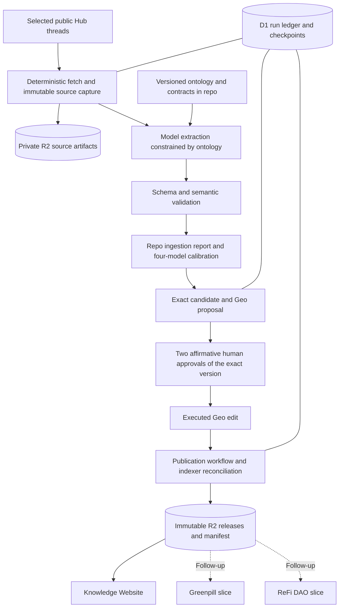

# Regen Knowledge Commons: a credible v1 pilot

Research and architecture proposal · 8 September 2026 · Revised 9 September 2026  
Decision lens: a small team shipping the fastest credible Hub → Geo → website flow.

**Recommendation:** build one Hono service in `packages/agent` on Cloudflare with two durable workflows: prepare proposals from selected Hub threads, and publish executed Geo edits into versioned R2 artifacts. Make a small executable ontology package the shared foundation. Begin with repo-based ingestion reports and four-model calibration; complete v1 when the Knowledge Commons website is live and the source-to-surface flow, review, correction, and recovery have been demonstrated.

**September 9 decisions:** Afo owns the ontology pin; use a shared Knowledge Object metadata base with class-specific schemas; require two affirmative human approvals; name the runtime package `agent`; start on the owned Knowledge Commons website. Greenpill and ReFi integrations are follow-up work. See the [pilot topics and models](2026-09-09-pilot-selection.md), [ontology candidate](../ontology/v1-candidate.md), and [ingestion reports](../../reports/ingestion/README.md). These user decisions supersede older planning scope below; the external Linear issues and Miro board have not been edited.

This is a proposal, not an implementation or a measured model evaluation. Before this research, the repo contained only a README and ignore file. Research covered every source requested in the objective: the brief, all three sync documents, the Miro board, linked Linear work, public project sites, and framework references. It also examined Green Goods code, upstream Geo SDK and governance contracts, Integrity Suite specifications, and official model documentation. Meeting summaries were read in full, with relevant transcript passages checked; the Miro frames were inspected visually. Source conflicts and remaining implementation questions are identified below.

## 1. Start from the decisions already made

The researched project definition takes a Hub thread through a Geo DAO space and R2 to three websites. Afo's September 9 scope makes the Knowledge Commons website the v1 surface, with partner integrations following. Geo remains the proposed canonical approved-knowledge layer. The repo holds schemas, code, contracts, development guidance, and now explicitly requested pre-Geo calibration reports. R2 holds materialized consumer artifacts. Review reports do not restore the previously removed GitHub mirror of accepted content.[^1]

The brief remains useful for audiences, ontology vocabulary, and competency questions. Its earlier repository-as-content-canon approach is superseded by the project update. Likewise, the existing toolkit framework is a source of lessons, not a mandatory migration base. Afo's September 1 response on KC-18 explicitly describes a fresh ontology-first approach with separate versioning, drawing on older work where useful. This resolves the strategic question raised in the preceding comment; it does not require reconciling every old type before starting.[^2][^3]

The meetings explain how this direction developed. August 6 emphasized class-specific schemas, code-based validation, Cloudflare hosting, and contributor capacity. August 20 narrowed the approach to a shared Knowledge Object metadata base, deterministic Hub harvesting, Geo, and portable skills followed by MCP. August 27 explicitly moved data out of git, kept the main branch focused on API and ontology, and proposed calibrating Integrity Suite scores before automatic filtering. Treat the earlier toolkit merge plan as historical context, with the later fresh-start clarification governing this repo.[^40][^41][^42]

The proposed first reader is someone coordinating a chapter, local node, community project, or shared initiative. “Organizer” means that practical role: finding an approach, understanding prerequisites, identifying collaborators, and checking what happened elsewhere. It is not a governance permission or a restriction on contributors. The first collection can use well-attributed Articles, Sources, and bounded Claims. A Playbook needs actionable steps; a proposal to write one is not yet a Playbook. Pattern generalization and CaseStudy outcomes need appropriate supporting evidence.[^2][^4]

There are three milestones. **Pre-Geo calibration** produces frozen evidence, comparable model outputs, and readable reports. **First vertical proof** takes one supported object through review, Geo execution, R2, and the owned website. **Full v1** adds the usable library, detail/provenance pages, filtering/search and contribution entry, a reviewed pilot collection, and demonstrated correction and recovery. A single static sample page is insufficient. The older three-surface requirement is superseded by Afo’s September 9 finish line. I recommend deferring the 3D graph until the core website and ingestion flow work; that sequencing is an architectural recommendation, not a separately confirmed user decision.[^1][^5]

## 2. Proposed architecture and authority boundaries

Use Cloudflare Workers for the Hono HTTP entry point, Workflows for resumable work, D1 for the operational ledger, and separate private and public R2 storage. This is one deployable service with distinct write and publication responsibilities. The website can deploy independently. Hono has an official Workers integration; the runtime choice still needs a small Geo SDK compatibility test.[^6]



The model interprets bounded source material. Application code owns fetching, identity, validation, transaction preparation, state transitions, and publication. Human governance owns ratification. This keeps an agentic API useful without requiring a general autonomous agent to navigate the whole internet or decide what the commons accepts.

| Layer | Authoritative for | Must not silently become |
|---|---|---|
| Repository | Schemas, mappings, prompts, code, release definitions, review-safe calibration reports | A second mirror of accepted content or a raw-source archive |
| Private raw-source storage | What was fetched, when, and from where | Publicly licensed or accepted knowledge |
| D1 ledger | Run identity, retries, proposal references, publication checkpoints | An alternative canonical graph |
| Geo DAO space | Executed knowledge and governance records | Proof that every accepted claim is true |
| Public R2 releases | Reproducible consumer snapshots derived from Geo | An independently edited content database |
| Websites | Audience-specific presentation | Another review or inference system |

### Ingestion and proposal preparation

An authenticated operation admits a bounded ingestion job and returns a run ID. The workflow fetches the topic and allowed linked sources, records content digests, and normalizes text without inference. Only then does the model classify content and propose entities, relationships, and evidence pointers. Validation produces either a steward-ready packet or an actionable rejection. A valid packet can become a Geo proposal; the process must not vote on its own proposal.[^7]

Before connecting publication to Geo, write one Markdown report per topic/run under `reports/ingestion`, with candidate meaning, evidence limits, the declared Integrity profile, per-model results, and human decisions. The [report specification](../../reports/ingestion/README.md) defines missing-score handling and approval evidence. These reports support rehearsal; they are not Geo votes or a new source of accepted public content.

**Geo and API keys:** the inspected [SDK README](https://github.com/geobrowser/geo-sdk/blob/2e76b9fb56d684b6500c49a32136e010a792dc69/README.md) separates operation construction, edit upload/calldata preparation, and `walletClient.sendTransaction`. Its DAO proposal helper prepares a proposal transaction. An API key may authenticate a hosted upload or delegated service, but an API-key-only production proposal path has not been verified. Confirm the endpoint, credential scope, signing identity, DAO membership, network, and sponsorship with the actual deployment. A hosted signing service could hide transaction mechanics behind an API; it still must preserve human review and exact proposal identity. Do not ask reviewers to manage these implementation details in the website flow.

Treat fetched text as evidence, including any embedded instructions. It cannot expand the fetch allowlist, alter the schema, select signing operations, or change governance parameters. Keep private keys outside prompts and model tools. Recheck redirects and destinations in the fetch adapter, and render source excerpts as untrusted text. These controls belong in application code so a more capable or less obedient model does not change the service's authority.

The first implementation should expose only a few capabilities: start or inspect an ingestion run, inspect the exact proposal packet, submit an eligible proposal through a controlled service operation, and inspect or reconcile a publication run. A human-facing chat interface and arbitrary model tool execution are unnecessary for this path. Validate authorization at the HTTP boundary and again at the operation boundary; model output is never an authorization decision.

Cloudflare Workflows can resume and retry steps, but external side effects still need idempotency. Put each durable unit of work inside an explicit workflow step and store its outcome. In particular, recording a successful external submission and sending that submission cannot be assumed to be one atomic transaction.[^8]

Persist the stable entity IDs and proposal intent before constructing an edit. Track the source digest, ontology version, extraction revision, operation digest, and submission status. If a submission times out, inspect the stored transaction or proposal state before submitting again. Do not regenerate IDs on retries. Keep an explicit uncertain-submission state when the chain outcome cannot yet be established; an operator should be able to reconcile it without repeating the model run.

### Publication and recovery

Publication reacts to **executed** edits. KC-25 describes a native ordered edit feed with onchain content identifiers. Treat that as the integration requirement, not evidence that a hosted push subscription with replay guarantees is already available. The SDK and skills confirm edit and proposal primitives; the precise event source, replay mechanism, and indexer watermark need an integration spike.[^9][^10]

Prefer durable checkpoints over graph-diff polling. If the supported source is chain logs, persist the relevant block, log position, and chain identity, account for reorgs, and backfill from the last safe checkpoint. Polling that event source on a schedule can be a reasonable first implementation; it does not require repeatedly comparing the whole graph. Bind every reader to the intended Geo space and proposal version.

An execution event may arrive before the indexer reflects it. Wait for evidence that the relevant edit is indexed before exporting. Do not label an arbitrary later graph snapshot as the exact state of an earlier edit. The release must identify the actual materialization checkpoint and included edit IDs, or use a verified version-aware query. Reconciliation should cover missed events, deletions, retractions, and delayed indexing.

Write artifacts under immutable release paths, validate them together, then advance a small manifest pointer. R2 has strong object consistency, but this is not a transaction across every object; concurrent writes are last-writer-wins and a CDN can still cache older responses. Use conditional writes and a serialized or monotonic publisher so a late workflow cannot move the pointer backwards. Readers resolve the manifest once and fetch only that release. Keep the last good release if publication fails.[^11]

A public manifest should carry its contract version, release ID, generation time, source-space/network identity, indexed checkpoint, included edit references, ontology version, and each artifact's digest and path. These are proposed contract fields, not claims about existing Geo fields. Publication health and each consumer's deployed release are separate signals: R2 can be current while a static partner site is still on yesterday's build.

### Hono with Workflows versus Flue

Flue is compatible with Hono rather than a competing router. Its documented route helpers expose conversations, and the Cloudflare target provides durable agent execution with SQLite-backed Durable Objects. Those are useful when work needs ongoing conversation state, steering, or a richer agent runtime. HTTP authentication remains an application responsibility, and durability does not remove uncertainty around interrupted external effects.[^12]

For this pilot, choose **plain Hono plus Workflows**. The work is a bounded sequence with well-defined inputs and outputs. Flue becomes worth reconsidering when editors need long-lived conversations that modify a running research task, or when maintaining conversation and agent state becomes a substantial part of the code. Avoid implementing both orchestration layers initially. Record this choice in a short ADR with that revisit trigger.

## 3. Make the ontology executable, small, and inspectable

The ontology should constrain both software and editorial judgment. A prose glossary alone will not prevent a model from inventing a predicate, merging two organizations, or calling a proposal an implemented practice. A giant schema alone will not explain why those distinctions matter.

Create a canonical TypeScript registry and class-specific Zod schemas in one package. Derive JSON Schema, type exports, a compact agent manifest, human-readable reference tables, and Geo mappings from those sources where possible. JSON Schema describes object shapes; separate semantic validators must check graph meaning, supported relationships, evidence resolution, and allowed transitions. Zod's JSON Schema export is useful, but not every runtime refinement has a JSON Schema equivalent.[^13]

Implement the August 20 Knowledge Object decision as a shared metadata envelope composed into each concrete schema. It should carry stable identity, provenance, version, and the agreed state and public-use fields. Keep domain-specific requirements in the concrete variants. This preserves the August 6 objection to flattening unlike objects into one universal schema, while avoiding deep inheritance trees or an accidental twelfth publishable class called Knowledge Object.[^40][^41]

### Resolve the baseline's ambiguities through real fixtures

The brief lists eleven class labels, including combined labels such as Organization/Network, Tool/Protocol, and Claim & Evidence, and twelve relationship groups. That is a conceptual baseline, not twelve unambiguous machine predicate identifiers. Some groups contain inverses or several predicates. The proposed funding relationship introduces a mechanism as a third participant, and supporting concepts appear in relationship descriptions without the same standing as the core classes.[^2]

The [v1 ontology candidate](../ontology/v1-candidate.md) now makes these choices concrete for Afo's pin: Claim with typed evidence records; a separately validated Playbook variant that is conceptually an Article subtype; Network under Organization, Protocol under Tool, and Bioregion under Place; stored predicates with derived inverses; funding relations retaining their mechanism. Review the fixtures and compatibility implications before activating the registry. The candidate is not yet pinned.

Pin the vocabulary needed to understand the full baseline, but enable creation only for the pilot subset. A practical initial subset is Article, Source, and a narrowly defined Claim representation. Existing organizations, people, tools, and places can be explicitly linked when their identity is known. Mark other types as reserved until their fixtures and semantics are reviewed. This is a staged implementation of the baseline, not an unannounced replacement ontology.[^3][^4]

Bootstrap also needs an explicit registry-to-Geo mapping: which types and properties already exist, which need creation, and which stable IDs the approved mapping uses. A merged code change must not silently activate unratified graph semantics. Prepare the registry revision and any Geo migration together, then activate the compatible version pair only when the required governance action has executed. Retain old readers or migrations for existing objects. The first ontology release needs the same documented stewardship as later changes, with its initial vocabulary and IDs inspectable before content proposals depend on them.

### Separate identity, evidence, and state

Use an opaque UUID as the durable entity identity and map it consistently to Geo's accepted identifier representation. Slugs remain readable aliases. Keep source location, entity identity, and revision digest distinct: an edited URL does not create a new organization, and two objects from one thread are not the same entity. Geo's ID utilities generate dashless UUIDs and accept supplied IDs; its DAO identifiers and author-space identifiers also have specific formats. Validate those at the adapter boundary.[^10]

Source identity should include the source system and native identifiers, such as topic ID and post ID, with an immutable content digest for each capture. Evidence should resolve to a captured post or source segment, including its selector and retrieval time. A model run records provider/model ID, prompt and schema versions, code revision, input artifact references, and structured output. W3C PROV-O's Entity, Activity, and Agent distinction is a useful mapping for these records; adopting a mapping does not require implementing an RDF store now.[^14]

Keep at least four dimensions distinct: the job's operational state, the proposal's governance state, the object's editorial maturity, and the evidence's uncertainty. The board's ore → craft → struck progression can describe intake, preparation, and release, but should never substitute for the underlying records or imply full CRAFT conformance. Record the assessment profile separately. An executed object can remain contested. A well-formed draft can remain unpublished. Beginner-oriented content can be mature and strongly evidenced.[^43]

The code should reject unsupported class/predicate combinations, unresolved required references, invented evidence selectors, incompatible versions, and unauthorized state transitions. It should flag suspected duplicates for a human decision rather than merge them from name similarity. Use controlled concept mappings for discoverability; SKOS mappings are a better starting vocabulary than treating every nearby term as exact identity.[^15]

### Keep the layers distinct

| Contract | Purpose | Minimum evidence or constraint |
|---|---|---|
| Raw source | Captured input without interpretation | URL/native ID, retrieval time, digest, access and reuse metadata |
| Candidate | Proposed structured interpretation | Exact source references, type, unresolved questions, extraction provenance |
| Proposal packet | Reviewable intended graph mutation | Stable IDs, operation digest, schema version, source evidence, proposed diff |
| Accepted projection | Executed state in the chosen Geo space | Edit/proposal/version references and verified materialization checkpoint |
| Slice v1 | Consumer-specific public view | Stable shape, release identity, source edit references, no SDK UUID knowledge required |

For the first competency tests, ask whether a user can find the source for a claim, distinguish a proposed practice from a demonstrated one, see an unresolved contradiction, and trace a revised object back to its preceding version. Later add context-dependent questions about funding mechanisms, organizational implementations, and bioregions. These tests connect the ontology to user value rather than rewarding the number of types modeled.[^2]

## 4. Use Integrity Suite concepts as review instruments

The linked structural-integrity suite is a set of structural standards; ORE, CRAFT, and STRUCK are separate repositories in the broader standards family. Use their specific definitions and versions when borrowing them. The standards index points to ORE 0.1.2, STRUCK 0.1.2, and CRAFT 0.4.4 at the time of research. A shared vocabulary does not establish that the Commons conforms to every requirement of those standards.[^16]

ORE is particularly useful at intake: distinguish origin, reliability, and exposure rather than reducing source quality to a single confidence number. Its treatment of circular corroboration fits a common failure mode in community knowledge: several posts repeat the same original claim and appear independent. STRUCK emphasizes traceable support, refutation, and visible contest without collapsing dimensions into a single verdict. CRAFT helps make review criteria and decision logic explicit before an assessment.[^17][^18][^19]

The August 27 discussion explicitly allows two levels of assessment. ORE and STRUCK can discipline the intake and release boundaries around a process without requiring the full CRAFT chain. Use that lighter profile for the initial resource collection; reserve a full CRAFT-derived assessment for work whose decision consequences require it. CRAFT 0.4.4 itself describes companion boundary obligations and equivalent declared obligations, so pin the actual requirements rather than turning the three names into a mandatory status ladder. Neither profile is a conformance claim until its requirements are implemented and verified.[^19][^42]

Start integrity scoring in **calibration mode**, as proposed in the August 27 transcript. Record assessments and the steward's eventual decision, and inspect false positives, missed defects, and disagreements before using a score threshold to discard content. Structural validation, evidence references, access boundaries, and human governance remain active from the start. Material can remain visible in the review queue despite a low provisional score without becoming public. Promote a scoring rule to enforcement only through a versioned, steward-reviewed decision with evidence from the pilot.[^42]

For v1, translate this into a short, versioned reviewer packet: what is proposed; exact source passages; origin and independence notes; missing or contradictory support; why the object type fits; intended public use; and the graph diff. Surface unsupported or AI-generated claims early so reviewers do not have to reconstruct the source chain. The ingestion filter improves review readiness; it does not certify truth.[^20]

Geo already exposes proposal reviews with content and ratings for completeness, accuracy, skill, and effort, along with separate curation, stance, and veracity responses. The SDK source confirms these primitives. Define the Commons' own bounded rating scales and mapping explicitly, and test their display and round trip. Do not assume the SDK enforces the desired numeric ranges, or treat agreement/upvotes as evidence quality.[^21]

Attach this assessment to the exact proposal version and operation digest. Human voting remains the promotion gate established by the project. If the proposed edit changes after review, the previous packet cannot authorize the new contents. Likewise, checking that two reviewer names are present in JSON is not equivalent to verifying two valid votes under the DAO's configured rules.

### Governance findings from the contract source

KC-23 intends two human ratifiers, an agent that does not vote, and published parameters. **Those intentions are not yet verified contract invariants.** The public DAO contract inspected at commit `f3af617985d70ab8cf62018060e19c0ab5fcd660` exposes several differences that matter before a binding vote. This source has not been matched to the Commons' eventual deployed contract.[^22][^39]

First, the execution grace period is an expiry window. The contract sets `executeBy` to the voting deadline plus that period; it does not impose a waiting period after approval. Slow proposals can execute before the deadline when universal support and quorum are met, and a supporting vote can execute the proposal immediately. Selecting SLOW or withholding our relayer therefore does not guarantee a pause for intervention. Use the deployed contract's `canExecuteProposal` result for eligibility, and treat a mandatory delay as a separate requirement requiring a verified mechanism.[^39]

Second, slow-path quorum counts YES, NO, and ABSTAIN participation. **Quorum 2 is not a minimum of two YES votes.** For example, with four editors, quorum 2, partial support 50%, and universal support 100%, one YES and one ABSTAIN can satisfy late execution after the voting deadline: participation is two, and all decisive votes support the proposal. This is an inference from the source arithmetic, not an observation of live Commons settings. The project's agent-abstention rule should mean no vote transaction at all; a formal ABSTAIN vote would contribute to quorum.[^39]

Third, the inspected code allows members or editors to propose but only editors to vote. A dedicated member-only machine identity therefore appears capable of proposing while lacking voting authority. KC-23 currently specifies an editor key for the agent, so this would be an explicit revision to the credential plan, supported by a target-network test. The proposed setting restricting new members' fast-path access also excludes members who are editors in this source; it must not be assumed to restrict an editor credential.[^39]

Finally, voting time starts with the first vote, rather than proposal creation, and a NO vote can escalate a fast proposal into the slow path with a restarted window. Review-queue age and voting age need separate monitoring. Editor-space IDs are not proof of distinct humans: steward enrollment must make that association.[^39]

Two affirmative human approvals are now a requirement, confirmed by Afo on September 9. Require two distinct authenticated humans approving the exact revision and scope. Verify an enforceable Geo configuration or extension across both execution paths before claiming this as a Geo guarantee; a publisher check cannot prevent an otherwise valid onchain execution. Test one YES plus one ABSTAIN, duplicate reviewer identity, early execution, stale proposal versions, changed operations, and a machine identity attempting to vote. A mandatory delay has not been requested and must not be inferred from the contract grace period. Keep voting functions out of the ingestion service.

## 5. Choose the model through steward effort and measured errors

Evaluate **four models on the same evidence: GPT-5.6 Luna, Gemini 3.5 Flash-Lite, Claude Sonnet 5, and GPT-5.6 Terra**. This provides two inexpensive baselines and two stronger comparison candidates across three providers. These roles are hypotheses, not measured results. The [pilot comparison plan](2026-09-09-pilot-selection.md) defines the initial topics, repetition, holdout, and per-thread reporting.

Current official OpenAI documentation lists Luna as the cost-sensitive tier and Terra as the balanced tier, both with structured output support. Pricing for the four selected models was rechecked September 9, 2026; model aliases, availability, and prices can change. Log the actual configuration for every run and repeat the fixed evaluation when it changes. Do not invent a dated snapshot where the provider documents only an alias.[^23]

The scenario below assumes **10,000 input tokens and 2,000 billed output tokens per extraction**, standard synchronous pricing, uncached short-context input, and no paid tools, retries, or additional reasoning tokens. Identical token counts are a comparison assumption, not identical text tokenization across vendors.

| Candidate | Input / output per million tokens | Per extraction | Per 1,000 extractions | Pilot role |
|---|---:|---:|---:|---|
| GPT-5.6 Luna | $0.20 / $1.20 | $0.0044 | $4.40 | Low-cost baseline |
| Gemini 3.5 Flash-Lite | $0.30 / $2.50 | $0.0080 | $8.00 | Cross-provider challenger |
| Claude Sonnet 5 | $2.00 / $10.00 | $0.0400 | $40.00 | Stronger comparison on difficult cases |
| GPT-5.6 Terra | $2.00 / $12.00 | $0.0440 | $44.00 | Challenger or escalation |

Rates are from the providers' official pricing pages. Anthropic's current page retains Sonnet 5 at $2/$10 and says the previously announced September increase was canceled. Google's page distinguishes free and paid tiers; use the actual intended service tier for the evaluation.[^24][^25][^26]

All four together cost $0.0964 per topic per pass under this scenario, or $1.446 for five topics with three passes. This is not a quote for the evaluation: source lengths, tokenization, reasoning, repairs, and multiple objects change actual usage. The useful economic unit is **cost per steward-accepted object**, including correction time and review overhead. One minute of avoidable human correction may dominate the difference between token rates.

Cloudflare's hosted open-weight gpt-oss-120b is another candidate: its model page lists $0.35 input and $0.75 output per million tokens, with function calling and reasoning. It can simplify provider integration for a Workers deployment. Treat it as an optional challenger after testing strict schema behavior and evidence quality; the pilot does not justify operating a dedicated GPU stack.[^27]

Use a thin provider adapter returning the same validated candidate contract, usage record, and refusal/error shape. A direct SDK is enough for the first provider. An abstraction library such as the AI SDK is reasonable if multiple providers become a real requirement, but it does not supply the domain validators or governance boundaries. Avoid building a universal model router before the first comparison.

### A small evaluation with meaningful gates

Start with the five explicit topics in the pilot manifest; derive adjudicated extraction cases, including abstentions and deliberately difficult examples, without inventing cases to meet a quota. Use three development topics, one validation topic, and one held-out topic excluded from prompt tuning. Include repeated claims from one origin, proposals without demonstrated outcomes, similar names, and missing linked material. Add synthetic adversarial fixtures separately and label them. Evaluate classification, relationship validity, evidence support, false merges, unsupported claims, latency, billed usage, and steward correction minutes.

Suggested initial release gates are 100% schema and reference validation for any submitted proposal, no unsupported claims or false entity merges in the held-out accepted set, and a complete source trail for every factual assertion admitted to the graph. Report sample size and failures rather than presenting a small clean set as a statistical guarantee. Compare all four selected models on the same cases before choosing the default. Two humans should resolve the gold labels; an LLM judge can help organize review but should not supply the ground truth.

Escalate on deterministic signals such as repeated validation failure, unresolved references, ambiguous class choices, or contested evidence—not solely a model's self-reported confidence. A stronger model can offer a better candidate; it cannot repair an inaccessible source or replace missing evidence. Bound source length, output length, retries, and per-run spending. Cache extraction results by source digest plus the relevant model, prompt, and ontology versions.

## 6. Borrow Green Goods' discipline, with fewer moving parts

Green Goods demonstrates a useful pattern: a Bun workspace with package boundaries, localized instructions, explicit public exports, and an ontology that generates compact agent context and human reference material. Its agent package uses Hono on Bun; that is architectural inspiration, not proof that its runtime configuration can be copied directly to Workers. The inspected checkout was commit `beb933e9727962fbbc448b99d5c673c7ed64318d`.[^28]

Its ontology source and projection configuration are separate, and generated projections have a drift check. The check's stated limits are valuable: matching documentation and source anchors does not prove runtime behavior. Borrow that honesty along with the generation mechanism. For this repo, keep declared capabilities visibly separate from implemented and verified ones.[^29]

Start with four workspaces:

```text
packages/
  ontology/       # Registry, Zod contracts, semantic validation, fixtures
  pipeline/       # Domain operations and Hub/model/Geo/R2 adapters
  agent/          # Hono Worker, workflows, bindings, operational ledger
  web/            # Astro library, graph view, contribution entry
docs/
  architecture/   # Short ADRs and package dependency rules
  ontology/       # Generated reference and curated rationale
  runbooks/       # Reconcile, replay, retract, restore, rotate keys
  research/       # Source-backed decisions and evaluations
reports/
  ingestion/      # Review-safe Markdown reports by topic and run
agent/
  skills/         # Canonical development and contribution workflows
  context/        # Small routing index and generated ontology context
```

Imports point inward: `agent → pipeline → ontology`, with the website also using public contracts from ontology. Pipeline code receives storage, model, and Geo adapters through explicit interfaces and does not import HTTP handlers. The website must not import transaction signing or provider clients. `packages/agent` is the runtime; root `agent/skills` is the instruction library. Keep public slice schemas under an export such as `ontology/slices`; split a contracts package only when independent releases justify it. Avoid creating a package for every adapter.

Bun is a reasonable workspace tool given the reference repo. Pin the actual package manager and dependency versions selected during bootstrap. Use TypeScript, one formatter/linter, and a small test setup appropriate to Workers and pure domain logic. Turbo becomes useful when shared build ordering and caching warrant it, but the package boundaries do not depend on adopting every Green Goods tool immediately.

The root README should identify the current architecture and entry points. A short root AGENTS.md should explain commands, package boundaries, source authority, and where to find the next relevant instruction. Nearest-package guidance should describe only local constraints. Generated ontology context should name its source and version. Avoid copying the entire research report into each agent's default context.

Use `agent/skills` as the canonical authoring location, matching the August 20 transcript and board. Provide harness-specific links or install metadata where a tool expects another directory, including `.agents/skills`; maintain one source rather than independently edited copies. Verify discovery with the actual chosen runtime—meeting shorthand about Cloudflare reading a directory is not an implementation guarantee.[^41][^43]

### Core skills worth establishing

The September 9 update adds repo workflows now: `commons-architecture`, `ontology-change`, `hub-intake`, and `publish-reconcile`, plus Matt Pocock's vendored `codebase-design` skill. Root [AGENTS.md](../../AGENTS.md) routes their use. The upstream skill is pinned with its MIT license and [provenance](../../agent/skills/codebase-design/UPSTREAM.md). Native harness discovery remains unconfigured; agents can read the canonical files directly. The broader table below describes capabilities to develop, not seven additional installed skills.

| Skill | Trigger and useful output | Required boundary |
|---|---|---|
| `repo-change` | A scoped implementation request; package impact, change, relevant validation | Read nearest instructions; preserve dependency direction |
| `ontology-change` | A class, predicate, meaning, or metadata change; examples, compatibility analysis, regenerated outputs | No silent vocabulary edits; distinguish code approval from knowledge governance |
| `prepare-contribution` | A contributor's resource or draft; a supported, clearly attributed Hub-ready contribution | Works in the contributor's preferred assistant; proposes corrections without publishing automatically |
| `hub-intake` | A selected topic; captured sources, candidate objects, concise reviewer packet | No invented evidence or automatic identity merges |
| `geo-proposal` | A validated packet; inspectable operations and proposal references | Pinned SDK/network, stable IDs, exact reviewed version; service never votes |
| `publish-reconcile` | An execution or failed publication; verified checkpoint and consistent release | Only executed state; idempotent replay; no pointer regression |
| `slice-change` | A consumer contract change; fixture, owner, version and migration plan | Preserve existing contracts until the agreed sunset |

Each skill should state its inputs, output evidence, authority, and failure conditions, with executable commands where possible. Shared rules belong in one place. Geo's query and publishing skills are useful upstream references, but their reviewed publishing skill targets SDK 0.20.1 while the SDK repository reports 0.20.3. Pin a tested coherent pair and adapt the authority boundaries; importing upstream instructions does not grant an ingestion agent voting authority.[^10]

For human contributors, the v1 contribution path should remain a clear Hub post entry point. Explain what a useful contribution includes: the practice or claim, its context, source links, observed outcomes where available, and permission or reuse constraints. Steward correction can use a compact review packet and Geo's existing UI initially. A new CMS, custom voting UI, and a contributor portal are separate projects unless the pilot proves they are necessary.[^1][^5]

Follow the meeting's skills-first, MCP-later sequence. Initially, contributors can use the preparation and ontology skills in their existing editor or assistant, with deterministic validation returning specific corrections before steward review. After the first vertical proof, expose the same domain operations through a thin authenticated MCP adapter if it removes real contributor friction. Begin with schema discovery, validation, and inspection of selected Hub work; broader cross-source ingestion remains a later scope decision. Reuse the same validators and authority checks as Hono rather than building a second ingestion system.[^41]

Make one guided contributor walkthrough and one steward review rehearsal part of the pilot. The August meetings identify tool familiarity and human coordination as constraints, not merely missing software. Track batch ownership and review commitments in Linear's two-week cycles; keep the DAO vote as the knowledge decision. The board makes that division explicit.[^40][^42][^43]

## 7. Design the public artifacts before building partner UI

Define the Commons dump first, with nodes, links, and metadata for library filtering. Add Greenpill and ReFi slices in follow-up integrations. Consumers should use a documented JSON shape rather than Geo's property IDs or GraphQL. Version each saved query and its output contract together; changes to selection semantics can matter even when shape is unchanged. Assign an owner for compatibility.[^30]

Use versioned paths such as `/slices/greenpill/v1/manifest.json`, with manifests pointing to immutable release files. Breaking changes require v2 alongside v1, a stated migration window, and a sunset agreed with the consumer. Define defaults for optional additions and test a real consumer fixture. Decide explicitly which editorial changes to selection criteria require governance; do not silently add a second content-approval system in git.

For the Knowledge Website, begin with a readable library page, a detail page showing provenance and status, simple filtering/search, and a prominent contribution link. The graph reads the same dump and follows after these basics. Astro's build-time content loaders can validate external data against a schema. A build-time collection refreshes through a new build, so publication must also trigger or schedule the consumer update and report failure separately.[^31]

The August 20 transcript discussed both build-time and live collections. That was an implementation option, not a decision that every website must query Geo at runtime. The current v1 board and issues choose generated artifacts. Start with build-time loading; a later live loader could still consume the same versioned R2 contract without exposing Geo queries to consumers.[^41][^43]

After the owned website is working, Greenpill is the preferred first partner because KC-28 identifies an existing toolkit block and relationship. Its live site also advertises a Knowledge Map in design, so settle that overlap before building a competing graph experience. Use the current block to prove a slice, with a named integration owner.[^32]

KC-29 describes the ReFi integration as a Quartz build-time consumer. The live Resources Hub links onboarding, core documents, and toolkit resources, but the website rendering alone does not verify its build implementation. Confirm the repo, maintainer, rebuild hook, and cadence. Only this Resources Hub integration is in scope; ReFi's separate documentation, Notion, blog, podcast, and forum are not new ingestion sources for v1.[^33]

R2 does not make existing sites update by itself. For each surface, track the intended release and observed deployed release. If an export succeeds but a site build fails, retain the site's last good content, expose the stale state operationally, and retry the build. Avoid reporting end-to-end success from a successful bucket write alone.

## 8. A practical pilot and rollout sequence

### Wave 1: establish evidence and remove external uncertainty

Use the [five-topic pilot manifest](2026-09-09-pilot-selection.md), starting with 235, 403, and 356. KC-19 and the homepage cite 31 top-level topics, but descendant listings contain additional topics; that is not a complete corpus boundary. The manifest defines inclusion, exclusions, capture completeness, and bounded outward traversal.[^4][^34]

Resolve what counts as a link layer in that manifest: the selected Hub thread is depth 0, a document it links is depth 1, and a link from that document is depth 2. The August discussions use both first-level posts plus linked documents and two-layer exploration. Default the first proof to depths 0–1, then admit depth 2 explicitly where it adds useful evidence. The board also flags Bloom's empty category; record it as a coverage gap rather than implying the pilot represents every partner.[^41][^42][^43]

In parallel within the work plan, confirm the Geo target network, DAO and author-space identifiers, governance parameters, funding/sponsorship, and edit-replay mechanism. Match the deployed implementation and actual settings to the reviewed source, and resolve the two-approval and execution-timing gaps before treating governance as ready. Run the smallest possible Workers smoke test against the pinned SDK: construct an edit, prepare a proposal in the designated environment, and read back its precise version. This research has not submitted transactions or verified a production deployment.[^10][^22][^35][^39]

Exit evidence for calibration: frozen pilot sources, reviewed ontology fixtures, per-topic Markdown comparisons, and a cadence with two available humans. Geo compatibility work can proceed alongside calibration; its readiness does not block preparing reports. Before the vertical proof, verify the runtime/network path. A testnet demonstration remains provisional, with identity and evidence preserved for migration.

### Wave 2: prove one object end to end

Implement the four-package skeleton and minimum contracts. Capture one Hub thread, compare extraction outputs, validate the selected candidate, generate its Markdown report, and prepare exact Geo operations. Obtain two affirmative human approvals through verified governance, observe execution and indexing, produce a versioned R2 release, and render it on the Knowledge Commons website.

A useful real fixture is the Hub thread proposing a commitment-pooling playbook. It describes planned work and links supporting material; later replies discuss a changing technical context and future updates. An appropriate first object would report that proposal with attribution. The thread alone does not establish a completed runnable playbook or successful outcomes. The linked document was not read in this research, so it supplies no additional evidence here.[^36]

Exit evidence: source passage → candidate → exact proposed operations → reviewed proposal version → execution → release → rendered object is traceable. Repeat the job without duplicate entities; simulate an uncertain submission and recover; verify that an unexecuted proposal never appears publicly.

### Wave 3: make the pilot reliable and compare models

Expand to the bounded source set. Run the fixed model evaluation, choose the cheapest configuration that meets the evidence gates, and calibrate batch size to reviewer capacity. Compare provisional integrity scores with steward decisions before adopting rejection thresholds. Exercise indexer delay, workflow replay, concurrent publication, source edits, consumer version mismatch, a retraction, and a failed website build. Finish the short contribution and operations runbooks.

Exit evidence: a second steward can use the packet without reconstructing provenance; a failed run can resume without repeating an external mutation; the previous public release remains available during failure. Record actual cost per accepted object and median source-to-site time, with waiting-for-review separated from processing time.

### Wave 4: finish the live Knowledge Commons v1

Complete the live library, readable object/provenance pages, filtering/search, and contribution entry. Publish the reviewed pilot collection, then demonstrate a correction and a retraction through the same source-to-surface path. Confirm the deployed release, recovery procedure, reviewer workflow, and ongoing owners. Greenpill and ReFi are follow-up integrations. The proposed website scope defers the 3D graph; revisit that recommendation if it is essential to the first user experience. A pre-Geo report or website preview is an intermediate milestone, not proof that the proposed Geo publication path works.

The original three-to-five engineer-week estimate included partner surfaces. Re-estimate the revised scope after the first vertical proof; Geo readiness and human review capacity still dominate uncertainty. The project's October 31 target is context, not evidence that dependencies are ready.[^1]

The August 27 transcript gives a useful intermediate aspiration: APIs and Geo setup by the end of September, with active pipeline runs and review sessions in October. Use that to place the four waves in the team's two-week cycles, while keeping exit evidence more important than calendar labels. Reconfirm availability rather than assigning work from a meeting attendance list.[^42]

### Cost and operations

At this scale, reviewer time, integration work, and transaction operations are likely more consequential than raw token or storage costs. Cloudflare currently lists a $5 Workers paid-plan base; R2 Standard lists $0.015/GB-month, $4.50 per million Class A operations, $0.36 per million Class B operations, and no egress charge. Allowances and other services affect the actual invoice; this is not a total deployment quote.[^37]

Measure proposal, vote, and execution costs on the chosen network. KC-33 explicitly leaves sponsorship eligibility and the paying owner unresolved. Do not assume every transaction is free because a sponsored path exists. Record wallet funding, top-up thresholds, service ownership, and what happens when funds or sponsorship stop.[^38]

A small operational dashboard can start as structured run status: queue age, human-review age, unknown submissions, failed execution reconciliation, publication lag, deployed release by consumer, model spending, and wallet/sponsorship health. Logs should correlate run, source digest, proposal/version, transaction, edit, and release without printing secrets or unnecessary raw source content.

## 9. Decisions for the working session

The most useful discussion is about the few choices that can change the first implementation. Geo canon, R2 publication, an abstaining agent, and a fresh ontology foundation already have project direction.

| Decision | Recommended starting position | Needed to close it |
|---|---|---|
| First useful collection | Organizer-facing Articles with Sources and bounded Claims | Pick the topics and one visible audience outcome |
| Ontology pin | Afo owns the pin; concrete Knowledge Object/class candidate is drafted | Afo's ratified version/digest and reviewed fixtures |
| Identity | Opaque UUID, stable Geo mapping, source/revision IDs separate | Verify SDK representation and migration policy |
| Runtime | Hono + Workflows; four workspaces | Geo-on-Workers smoke test |
| Model | Compare Luna, Gemini Flash-Lite, Sonnet, and Terra | Same evidence/configuration records, human labels, measured errors and cost |
| Integrity assessment | Calibrate scores first; lighter ORE/STRUCK-informed profile for routine resources | Named steward, comparison with human decisions, and an explicit trigger for full CRAFT assessment |
| Contribution tooling | Canonical `agent/skills`; MCP adapter after the first proof | Contributor walkthrough and demonstrated need for the next interface |
| Governance | Two distinct affirmative humans required; machine cannot vote | Named reviewers and proof for exact revisions under actual Geo rules |
| Production readiness | Confirm network, indexing and replay before calling content durable | Geo configuration, operational owner, funding |
| First surface | Knowledge Commons website, owned by this project | Live useful library and verified deployed release |
| Consumer contracts | Immutable releases, versioned manifests, last good build | Slice owner and rebuild cadence for each partner |
| Full-v1 finish | Sources to the functional live Commons website, with ingestion calibration | Reviewed collection, source trails, model comparisons, correction and recovery evidence |

The manifest and ontology candidate are now drafted, and Afo is the ontology owner. Remaining setup work is to ratify the candidate with fixtures, name two available content reviewers, establish provider access, and verify the Geo credential/deployment path. Federation, a new reputation system, and a general research agent remain outside this pilot.

## 10. Limits, source conflicts, and what remains to verify

The three supplied meeting documents and Miro board have been read and reconciled. The Google documents contain Gemini-generated summaries and transcripts, not guaranteed verbatim records; the relevant August 20 and 27 transcript passages were checked for the decisions used here. Historical references to Aragon, framework names, project names, and completion dates are meeting context, not independent proof of current software behavior. Current code and official documentation govern technical claims. No raw meeting export has been copied into this repository.[^40][^41][^42]

The Miro board is useful but contains mixed revisions. Its Geo frame still says GitHub mirrors canonical content, and the publication connector still says “mirror to GitHub,” while the API and repo frames already name R2. The repo frame also places R2 beside a PR-review arrow, which could imply an extra content gate. Follow the explicit August 27 and Linear decisions: code and contracts use PR review; accepted knowledge is governed in Geo and exported to R2.[^1][^42][^43]

When the board is next edited, remove the stale mirror labels, move R2's materialized state outside the repo boundary, distinguish provisional integrity scoring from enforcement, and show that full CRAFT assessment is conditional. Update the governance annotations to separate the intended two-human policy from verified contract rules. The board's Coop sample illustrates a possible future overlap; it does not add Coop or a second approval system to this v1. These are proposed board corrections; this research did not modify the board.[^43]

The Geo SDK repository reported 0.20.3, while the reviewed upstream publishing skill pins 0.20.1 and explicitly targets testnet. The built-in network file inspected exposes a testnet configuration. This is evidence of a compatibility and configuration question, not proof that Geo has no production network. The public DAO source clarifies voting and execution semantics, including behavior broader than the publishing skill's conservative execution recipe. Deployment identity, actual settings, production readiness, event replay, and indexer consistency remain unverified.[^10][^35][^39]

The brief's proposed public-use defaults do not establish rights to republish every linked source. Preserve source-specific access and reuse information, choose the repository's own license explicitly, and keep raw captures private by default. For a rights-uncertain source, the pilot can publish a link and a supported original summary where appropriate while withholding the underlying content; do not automatically stamp everything with the brief's proposed license. This is an implementation requirement to track, not a legal conclusion about any particular source.[^2]

Finally, content addressing verifies correspondence to bytes, and a successful governance vote verifies acceptance under configured rules. Neither guarantees source truth, independent corroboration, or permanent availability of all offchain content. Keep evidence, contest, storage recovery, and operational ownership visible. The credible pilot is the one whose users and stewards can inspect those limits while still finding something useful.

## Sources and access register

All sources were accessed on 8 September 2026 unless a source's own date is stated. Linear and Google documents are internal project evidence. Framework, model, and standards claims use first-party documentation or repositories. Recommendations, rollout estimates, contract designs, and evaluation thresholds are this report's proposals.

[^1]: [V1 · Commons Pipeline — Hub to Surfaces](https://linear.app/regen-coordination/project/v1-commons-pipeline-hub-to-surfaces-99eb294c96b3/overview), current description, explicit R2 update, scope, and milestones. Read through Linear. Some older text in the same description still mentions git; the explicit update takes precedence.
[^2]: [Regen Coordination Knowledge Commons — v0 Ontology, Problem Statement, and Audiences](https://docs.google.com/document/d/1-1kuPml2Dz6W8E5Ib8ruigJwK6FvqRgjtyhvJ_TUCgw/edit), read through a local Markdown export. This is the goal's linked v1 brief, with an earlier ontology/repository proposal in its contents.
[^3]: [KC-18: Ratify and pin v0 ontology](https://linear.app/regen-coordination/issue/KC-18/ratify-and-pin-v0-ontology-11-classes-12-predicates-metadata-baseline), including Luiz's August 31 question and Afo's September 1 response establishing the fresh approach.
[^4]: [KC-19: Pilot the v0 ontology against the Regen Hub](https://linear.app/regen-coordination/issue/KC-19/v1-step-1-pilot-the-v0-ontology-against-the-regen-hub), source and scope questions, outward crawl, and pilot acceptance.
[^5]: [KC-27: Regen Knowledge Website — library, 3D render, contribute](https://linear.app/regen-coordination/issue/KC-27/regen-knowledge-website-library-3d-render-contribute), static dump and current website scope.
[^6]: [Cloudflare: Hono on Workers](https://developers.cloudflare.com/workers/framework-guides/web-apps/more-web-frameworks/hono/), deployment integration.
[^7]: [KC-24: Agentic API write mode](https://linear.app/regen-coordination/issue/KC-24/agentic-api-write-mode-harvest-apply-ontology-proposeedit-into-geo), separation of deterministic harvesting, ontology application, and proposing.
[^8]: [Cloudflare: Rules of Workflows](https://developers.cloudflare.com/workflows/build/rules-of-workflows/), step boundaries, retries, and side-effect guidance.
[^9]: [KC-25: Publish mode](https://linear.app/regen-coordination/issue/KC-25/agentic-api-publish-mode-watch-executed-edits-sync-to-r2-regenerate), executed-edit trigger, R2 artifacts, and removal of GitHub sync.
[^10]: [Geo SDK README at inspected commit](https://github.com/geobrowser/geo-sdk/blob/2e76b9fb56d684b6500c49a32136e010a792dc69/README.md), [ID utilities](https://github.com/geobrowser/geo-sdk/blob/2e76b9fb56d684b6500c49a32136e010a792dc69/src/id-utils.ts), [network configuration](https://github.com/geobrowser/geo-sdk/blob/2e76b9fb56d684b6500c49a32136e010a792dc69/src/networks.ts), and [Geo publishing skill at inspected commit](https://github.com/geobrowser/geo-skills/blob/29099c12e73094520fbb7861b3169d108da52f3d/geo-publish/SKILL.md). Inspected SDK package version 0.20.3; publishing skill 0.2.0 pins SDK 0.20.1 and testnet. The skills are research evidence, not adopted local authority.
[^11]: [R2 consistency](https://developers.cloudflare.com/r2/reference/consistency/) and [Workers R2 API](https://developers.cloudflare.com/r2/api/workers/workers-api-reference/), object consistency and conditional operations. The multi-object release protocol is a proposed application design.
[^12]: [Flue routing](https://flueframework.com/docs/guide/routing/) and [Flue Cloudflare target](https://flueframework.com/docs/guide/cloudflare-target/), Hono helpers, conversation execution, authentication responsibility, and Durable Objects runtime.
[^13]: [KC-10: Common output and storage schemas](https://linear.app/regen-coordination/issue/KC-10/converge-on-common-output-and-storage-schemas-zod-with-object-specific) and [Zod JSON Schema documentation](https://zod.dev/json-schema), shape contracts and export limitations.
[^14]: [W3C PROV-O](https://www.w3.org/TR/prov-o/), Entity, Activity, Agent, and provenance vocabulary. The proposed Commons field mapping is not a conformance claim.
[^15]: [W3C SKOS Reference](https://www.w3.org/TR/skos-reference/), concepts and mapping relationships.
[^16]: [Structural Integrity Suite repository](https://github.com/coordination-structural-integrity-suite/suite), [Integrity Suite website](https://integritysuite.org/), and [standards index](https://github.com/durgadasji/standards-index). Read the supplied suite and the index to distinguish the related standards and their versions.
[^17]: [ORE repository](https://github.com/CrossWalkri/ORE), README and linked conformance structure: origin, reliability, exposure, source independence, and benchmark failure cases.
[^18]: [STRUCK repository](https://github.com/CrossWalkri/STRUCK), README: release support, provenance, refutation, contest, and separation of assessment dimensions.
[^19]: [CRAFT meta-standard](https://github.com/CrossWalkri/craft-meta-standard), README: decision context, ontology, instruments, criteria, logic, and feedback. Its stated assessment status does not establish independent accreditation for this project.
[^20]: [KC-13: Design the ingestion filter](https://linear.app/regen-coordination/issue/KC-13/design-the-ingestion-filter-validate-and-summarize-sources-before), preparation before human review and treatment of unreviewed AI material.
[^21]: [KC-12: Geo review primitives](https://linear.app/regen-coordination/issue/KC-12/wrap-geos-review-primitives-in-integrity-suite-vocabulary-do-not), [SDK proposal review implementation](https://github.com/geobrowser/geo-sdk/blob/2e76b9fb56d684b6500c49a32136e010a792dc69/src/ops/proposal-reviews.ts), and SDK README response examples.
[^22]: [KC-23: Set Geo DAO governance parameters](https://linear.app/regen-coordination/issue/KC-23/blocker-set-geo-dao-governance-parameters-before-the-first-binding), decided quorum and agent abstention, unresolved parameters, and the grace-period wording that requires contract verification.
[^23]: [OpenAI GPT-5.6 Luna](https://developers.openai.com/api/docs/models/gpt-5.6-luna), [GPT-5.6 Terra](https://developers.openai.com/api/docs/models/gpt-5.6-terra), and [GPT-5.4 mini](https://developers.openai.com/api/docs/models/gpt-5.4-mini), retrieved through the official documentation connector. These describe capabilities and current identifiers, not Commons-specific evaluation results.
[^24]: [OpenAI API pricing](https://developers.openai.com/api/docs/pricing), official documentation connector, standard short-context uncached token rates. Calculations exclude discounts, caching, tools, and unmodeled token usage.
[^25]: [Gemini API pricing](https://ai.google.dev/gemini-api/docs/pricing), Gemini 3.5 Flash-Lite rates and service-tier distinctions.
[^26]: [Anthropic pricing](https://platform.claude.com/docs/en/about-claude/pricing), current Sonnet 5 rates and cancellation of the previously planned increase.
[^27]: [Cloudflare gpt-oss-120b](https://developers.cloudflare.com/workers-ai/models/gpt-oss-120b/), listed hosted-model pricing and capabilities.
[^28]: Green Goods local code: [root instructions](/Users/afo/Code/greenpill/green-goods/AGENTS.md), [agent package](/Users/afo/Code/greenpill/green-goods/packages/agent/package.json), and [package instructions](/Users/afo/Code/greenpill/green-goods/packages/agent/AGENTS.md), inspected at commit `beb933e9727962fbbc448b99d5c673c7ed64318d`. These local links require that checkout.
[^29]: Green Goods [ontology source](/Users/afo/Code/greenpill/green-goods/packages/shared/src/ontology/green-goods-ontology.json), [projection configuration](/Users/afo/Code/greenpill/green-goods/packages/shared/src/ontology/green-goods-projections.json), [ontology context](/Users/afo/Code/greenpill/green-goods/.claude/context/ontology.md), and [generated agent manifest](/Users/afo/Code/greenpill/green-goods/packages/shared/src/ontology/agent-manifest.generated.json). Read as architectural evidence; no Green Goods code was changed.
[^30]: [KC-26: Slice contracts v1](https://linear.app/regen-coordination/issue/KC-26/slice-contracts-v1-schema-versioning-deprecation-policy-and-an-owner), versioned queries and output shapes, migration ownership, and open governance question.
[^31]: [Astro content collections](https://docs.astro.build/en/guides/content-collections/), build-time loaders and schema validation. Select the actual Astro version during implementation rather than copying an older API example.
[^32]: [KC-28: Greenpill integration](https://linear.app/regen-coordination/issue/KC-28/greenpill-network-integration-library-regen-toolkit-block-consumes) and [Greenpill Network](https://greenpill.network/), existing resources and Knowledge Map overlap. The live homepage was inspected; the separate Library page did not load through the research tool.
[^33]: [KC-29: ReFi DAO integration](https://linear.app/regen-coordination/issue/KC-29/refi-dao-integration-resources-hub-consumes-slice-v1-quartz-build-time) and [ReFi Resources Hub](https://refidao.com/resources-hub). Quartz is reported by the issue; the partner repository was not inspected.
[^34]: [Regen Coordination Hub](https://hub.regencoordination.xyz/) and [Regen Coordination category](https://hub.regencoordination.xyz/c/regen-coordination/4), live category counts and descendant listings. No full-corpus enumeration was performed.
[^35]: [KC-32: Confirm Geo SDK mainnet path](https://linear.app/regen-coordination/issue/KC-32/confirm-geo-sdk-mainnet-path-before-committing-the-canonical-layer), configuration, versioning, and indexer questions; [Geo Browser](https://www.geobrowser.io/), product context. No live DAO settings or production transaction were verified.
[^36]: [Proposal to develop a commitment pooling playbook](https://hub.regencoordination.xyz/t/proposal-to-develop-a-commitment-pooling-playbook-for-regen-coordination-network/356), public thread and replies. The linked Google document was not read. Another candidate implementation-report thread could not be fetched and was excluded from findings.
[^37]: [Cloudflare Workers pricing](https://developers.cloudflare.com/workers/platform/pricing/) and [R2 pricing](https://developers.cloudflare.com/r2/pricing/), current base and unit rates; account allowances and actual workloads were not measured.
[^38]: [KC-33: Gas and running costs](https://linear.app/regen-coordination/issue/KC-33/who-pays-for-the-transactions-gas-and-running-costs-for-the-v1), unresolved sponsorship, funding, and operational ownership.
[^39]: [Geo DAO contract](https://github.com/geobrowser/geo-contracts-foundry/blob/f3af617985d70ab8cf62018060e19c0ab5fcd660/src/contracts/DAOSpace.sol) and [interface](https://github.com/geobrowser/geo-contracts-foundry/blob/f3af617985d70ab8cf62018060e19c0ab5fcd660/src/interfaces/IDAOSpace.sol), inspected at commit `f3af617985d70ab8cf62018060e19c0ab5fcd660`. Relevant implementation: eligibility and thresholds at lines 260–323; proposer roles at 480–499; timers at 509–535; voting and automatic execution at 581–632; unrestricted eligible execution at 661–669; member restrictions at 823–831; voting role/version checks at 885–907. [Test specification](https://github.com/geobrowser/geo-contracts-foundry/blob/f3af617985d70ab8cf62018060e19c0ab5fcd660/test/unit/DAOSpace.tree) also inspected; its tests were not executed. This is source analysis, not deployed-bytecode verification or a contract audit.
[^40]: [August 6 engineering sync — full notes](https://docs.google.com/document/d/1ARP8Qg1_42PkLGs421z03CsyG6rDoFi7l2xsbLesYAM/edit?tab=t.7hprdn29ujv6). Quick notes and full notes read. Relevant discussion: repository slices at 00:17–00:25, shared schemas at 01:03–01:05, contributor onboarding and human coordination. Later project decisions supersede the earlier merge strategy.
[^41]: [August 20 engineering sync — full notes](https://docs.google.com/document/d/1QAjOyFo0TmnQEtxUAgVlH8alnBTTvYomdHwom8EjpLE/edit?tab=t.qmyyjq7lm7c1) and [transcript](https://docs.google.com/document/d/1QAjOyFo0TmnQEtxUAgVlH8alnBTTvYomdHwom8EjpLE/edit?tab=t.f7epzutieqq0). Quick and full notes read; relevant transcript passages checked: Knowledge Object metadata at 00:20:22, collection alternatives at 00:53:10, skills/MCP/editor workflows at 00:58:42–01:03:53, including `agent/skills`.
[^42]: [August 27 Commons sync — full notes](https://docs.google.com/document/d/1f5L4VsPg5sqSXSHDZ2MGdPB-98zuXKXQ_TEkpUfz3ik/edit?tab=t.55hp53ottqk4) and [transcript](https://docs.google.com/document/d/1f5L4VsPg5sqSXSHDZ2MGdPB-98zuXKXQ_TEkpUfz3ik/edit?tab=t.ia6cc22o3kzx). Quick and full notes read; relevant transcript passages checked for initial score calibration around 00:29:30 and timeline/optional CRAFT assessment at 01:01:38–01:05:05. The full notes also record data outside git, a focused main branch, and contributor onboarding needs.
[^43]: [Regen Knowledge Commons Miro board](https://miro.com/app/board/uXjVGzffNK8=/?share_link_id=297365240249), directly inspected through the frame index and screenshots. Read the nine core v1 architecture frames, Linear coordination, responsibility matrix, Coop sample, and legend. The API flows bottom to top; the board contains both R2 references and stale GitHub-mirror labels. [KC-16](https://linear.app/regen-coordination/issue/KC-16/knowledge-flow-visual-map-board-drafted-needs-review-and-promotion-to) provides its project context. The Mermaid diagram in this report is a reconciled proposal, not a reproduction of every board element.

### Reconciliation of the supplied meetings and board

| Source | Evidence reviewed | Effect on this proposal |
|---|---|---|
| [Engineering sync, August 20](https://docs.google.com/document/d/1QAjOyFo0TmnQEtxUAgVlH8alnBTTvYomdHwom8EjpLE/edit) | Quick notes, full notes, relevant transcript passages | Shared metadata envelope; `agent/skills`; skills first, MCP later; bounded deterministic harvest |
| [Toolkit engineering sync, August 6](https://docs.google.com/document/d/1ARP8Qg1_42PkLGs421z03CsyG6rDoFi7l2xsbLesYAM/edit) | Quick and full notes | Preserve class-specific semantics and contributor capacity; supersede the older merge plan explicitly |
| [Latest Commons sync, August 27](https://docs.google.com/document/d/1f5L4VsPg5sqSXSHDZ2MGdPB-98zuXKXQ_TEkpUfz3ik/edit) | Quick notes, full notes, relevant transcript passages | R2/data separation; calibration before score enforcement; optional full CRAFT assessment; September/October sequencing |
| [Miro architecture board](https://miro.com/app/board/uXjVGzffNK8=/?share_link_id=297365240249) | Overview, frame index, and visual inspection of all 13 indexed frames | Confirm v1 flow, surface scope and responsibilities; identify mirror-label drift, Bloom coverage gap, and board corrections |
